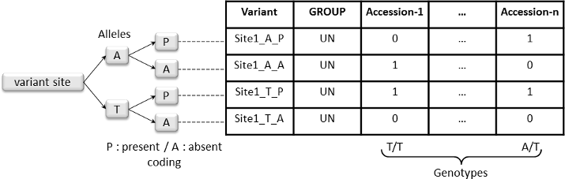
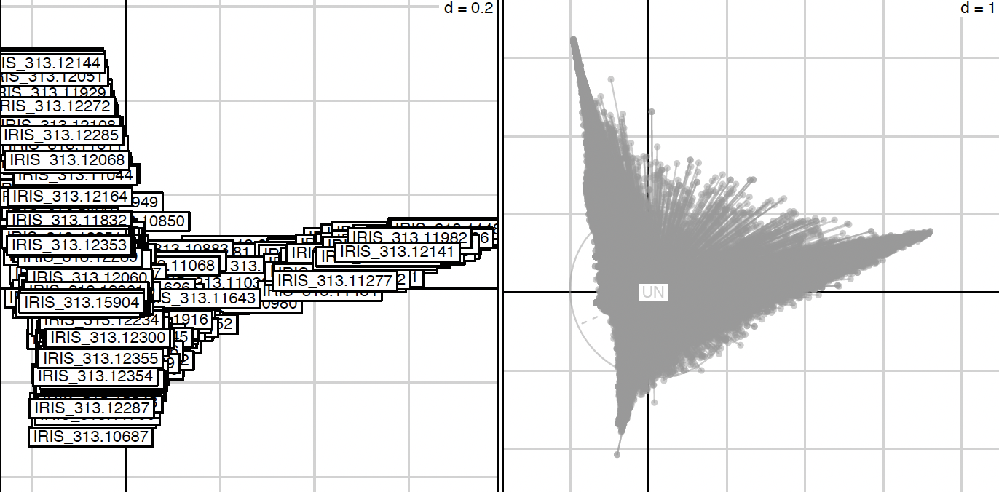
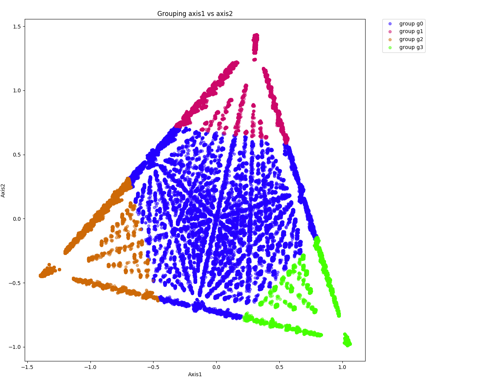

PCA analysis
============

Datasets
~~~~~~~~

- Download Rice 3K RG 404k CoreSNP Dataset, all chromosomes

::

   wget https://s3.amazonaws.com/3kricegenome/snpseek-dl/3krg-base-filt-core-v0.7/core_v0.7.bed.gz
   wget https://s3.amazonaws.com/3kricegenome/snpseek-dl/3krg-base-filt-core-v0.7/core_v0.7.bim.gz
   wget https://s3.amazonaws.com/3kricegenome/snpseek-dl/3krg-base-filt-core-v0.7/core_v0.7.fam.gz

   gunzip core_v0.7.bed.gz
   gunzip core_v0.7.bim.gz
   gunzip core_v0.7.fam.gz

- Download information for a subset of these accession

::

   wget https://raw.githubusercontent.com/SantosJGND/Galaxy_KDE_classifier/v1.2/Downstream_functions/Analyses_Jsubtrop_self_KDE/Order_core.txt
   grep -v "COUNTRY" Order_core.txt | cut -f 2 > sample.txt

Workflow
~~~~~~~~

- Convert to vcf using plink

::

   plink --bfile core_v0.7 --recode vcf-iid --keep-fam sample.txt --out core_v0.7

- Adjust some missing value on vcf file

::

   sed -i 's=GT=GT:AD:DP=' core_v0.7.vcf
   sed -i 's=0/0=0/0:20,0:20=g' core_v0.7.vcf
   sed -i 's=0/1=0/1:10,10:20=g' core_v0.7.vcf
   sed -i 's=1/1=1/1:0,20:20=g' core_v0.7.vcf
   sed -i 's=\.\/\.=\.\/\.:\.,\.:\.=g' core_v0.7.vcf

The first step of the Chromosome painting is to perform a PCA analysis on the vcf file to cluster the alleles and the accession.
Create a folder in which the analysis will be performed and run the following command line:

::

   mkdir PCA
   vcf2struct.1.0.py --vcf core_v0.7.vcf --names sample.txt --type FACTORIAL --prefix PCA/Analysis --nAxes 6 --mulType coa

The last command line run the factorial analysis (–type FACTORIAL option).
During this analysis the vcf file is recoded as followed :
For each allele at each variants site two markers were generated; One marker
for the presence of the allele (0/1 coded) and one for the absence of
the allele (0/1 coded).

Only alleles present or absent in **part** (not all) of selected
accessions were included in the final matrix file named
**PCA/Analysis_matrix_4_PCA.tab** in this example. An
additional column named “GROUP” can be identified. This column is filled
with “UN” value if no –group argument is passed. We will explain later
this argument.

The factorial analysis (here a COA, –mulType option) was performed on
the transposed matrix using R (The R script is generated by the script
and can be found here: **PCA/Analysis_multivariate.R**). R
warning messages and command lines are recorded in the file named
**Analysis_multivariate.Rout**. Graphical outputs of the analysis
were draw and for example accessions and alleles can be projected along
axis in the following picture.

In this example the left graph represent accessions projected along
axis 1 and 2 and the right represent the allele projected along
synthetic axis. A graphical representation is performed for each axis
combinations and each file is named according to the following
nomenclature ***prefix + _axis_X_vs_Y.pdf***. Several pdf for
accessions along axis only is also generated and are named according to
the following nomenclature ***prefix + _axis_X_vs_Y_accessions.pdf***.

Individual and variables coordinates for the selected 6 first axis
(--nAxes option) are recorded in files named
**PCA/Analysis_individuals_coordinates.tab** and
**PCA/Analysis_variables_coordinates.tab** respectively.
A third file named
**PCA/Analysis_variables_coordinates_scaled.tab**
containing allele scaled coordinates (columns centered and reduced)
along synthetic axis is generated.

::

   sort -k 2n,2 PCA/Analysis_individuals_coordinates.tab | cut -f 1 -d " " | tail -10 > origin.txt
   sort -k 3n,3 PCA/Analysis_individuals_coordinates.tab | cut -f 1 -d " " | tail -10 >> origin.txt
   sort -k 3nr,3  PCA/Analysis_individuals_coordinates.tab | cut -f 1 -d " " | tail -10 >> origin.txt
   sed -i 's:\"::g' origin.txt
   sed -i 's=\.=-=' origin.txt

The --group option

We assume that in some case you have additional informations on your dataset such as which accessions are admixed and which accessions are likely to be the ancestral one. And maybe you want to verify/project this information in your analysis. This can be done passing a configuration file with two section to the --group option. This file can be found in the data/config/ folder and is named AncestryInfo.tab. You can have a look at the file if you want but basically the two sections are named [group] and [color] and contained respectively the accession suspected grouping and a color (in RGB proportion) you want to attribute to each group. Accessions with no group should filled with "UN" value.

.. warning:: Group name should be written in upper case (due to R sorting).

::

   mkdir -p PCA_group
   vcf2struct.1.0.py --vcf core_v0.7.vcf --names origin.txt --type FACTORIAL --prefix PCA_group/Analysis --nAxes 6 --mulType coa

::

   vcf2struct.1.0.py --type VISUALIZE_VAR_2D --VarCoord PCA_group/Analysis_variables_coordinates.tab --dAxes 1:2 --mat PCA_group/Analysis_kMean_allele.tab --group PCA_group/Analysis_group_color.tab --prefix PCA_group/AlleleGrouping

**Mean Shift clustering**
Now that allele have been projected along synthetic axes, it is time to cluster these alleles. The idea is that the structure reflected by the synthetic axis represent the ancestral structure. In this context, the alleles at the extremities of the cloud of points will be the ancestral ones. These alleles can be clustered using several approaches. In this tutorial we will use a Mean Shift clustering approach.

::

   vcf2struct.1.0.py --type SNP_CLUST-MeanShift --VarCoord PCA_group/Analysis_variables_coordinates.tab --dAxes 1:2 --mat PCA_group/Analysis_matrix_4_PCA.tab --thread 8 --prefix PCA_group/Analysis --quantile 0.15

The Mean Shift clustering is performed with only the 2 first axes of the COA (--dAxes 1:2) because the analysis showed that most of the inertia is on these axes. With a mean shift approach, the number of group is automatically detected.

During the process, several informations are returned to standard output, but at the end of the process three main informations are returned:

- the number of alleles used for the analysis. Allele present or absent in all accessions are removed.

- the number of estimated clusters which can be found in the line:

::

   number of estimated clusters : 4

- the number of allele grouped within each group is returned and should look like as followed:

::

   Group g0 contained 163788 dots
   Group g1 contained 54919 dots
   Group g2 contained 43346 dots
<<<<<<< HEAD
   Group g3 contained 37535 dots
=======
   Group g3 contained 37535 dots
>>>>>>> 97bc9b57f5c02f3a935795eaba0dc87d1535f6e2
