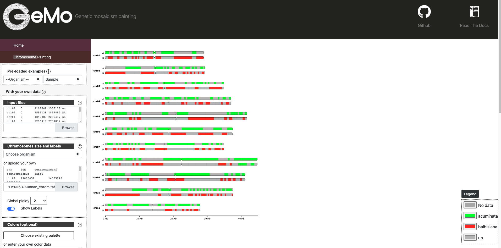

Quick Start
===========

The objective of this tutorial is to reproduce part of the results presented in Baurens et al (2019) and Ahmed et al (2019), using respectively VCFHunter and TraceAncestor.

The outputs of these programs can then be used in the GeMo webapps.

Installation requirements
~~~~~~~~~~~~~~~~~~~~~~~~~

This tutorial is developed to run on Linux or Apple (MAC OS X) operating systems. There are no versions planned for Windows.

Software requirements:

-  Perl 5 for TraceAncestor
-  Python 3 for VCFHunter

Testing your Perl installation
^^^^^^^^^^^^^^^^^^^^^^^^^^^^^^

To test that Perl 5 is installed, enter on the command line

::

    perl -version

Testing your Python installation
^^^^^^^^^^^^^^^^^^^^^^^^^^^^^^^^

To test that Python 3 is installed, enter on the command line

::

    python3 --version

Now, you can clone the repository, create a virtualenv and install several additionnal package using pip.

::

   git clone https://github.com/gdroc/GeMo_tutorials.git
   cd GeMo_tutorials
   python3 -m venv $PWD/venv
   source venv/bin/activate
   pip install numpy
   pip install matplotlib
   pip install scipy

Download Dataset
~~~~~~~~~~~~~~~~

For this tutorial, Dataset that will be used by TraceAncestor or by VCFHunter are accessible on Zenodo https://doi.org/10.5281/zenodo.6539270

To download this, you only need to launch the script download_dataset.pl without any parameter

::

   perl download_dataset.pl

This script create a new directory data

::

   data/
   ├── Ahmed_et_al_2019_color.txt
   ├── Ahmed_et_al_2019_individuals.txt
   ├── Ahmed_et_al_2019_origin.txt
   ├── Ahmed_et_al_2019.vcf
   ├── Baurens_et_al_2019_color.txt
   ├── Baurens_et_al_2019_individuals.txt
   ├── Baurens_et_al_2019_origin.txt
   ├── Baurens_et_al_2019_chromosome.txt
   └── Baurens_et_al_2019.vcf

These files are require for this tutorial to run VCFHunter or TraceAncestor

Input
~~~~~

- Baurens_et_al_2019_origin.txt : A two column file with individuals in the first column and group tag (i.e. origin) in the second column

=========== ======
individuals origin
=========== ======
P2          AA
T01         BB
T02         BB
T03         AA
T04         AA
T05         AA
T06         AA
T07         AA
T08         BB
=========== ======

- Baurens_et_al_2019.vcf : A vcf file with ancestral and admixed individuals

::

   grep #CHROM data/Baurens_et_al_2019.vcf
   #CHROM	POS	ID	REF	ALT	QUAL	FILTER	INFO	FORMAT	ACC48-FPG	ACC48-FPN	ACC48-P_Ceylan	ACC48-Red_Yade	DYN163-Kunnan	DYN275-Pelipita	DYN359-Safet_Velchi	GP1	GP2	P1	P2	T01	T02	T03	T04	T05	T06	T07	T08	T10	T11

- Baurens_et_al_2019_individuals.txt : A two column file with individuals to scan for origin (same as defined in the VCF headerline) in the first column and the ploidy in the second column.

- Baurens_et_al_2019_color.txt : A color file with 4 columns: col1=group and the three last column corresponded to RGB code.

===== ========== === === =
group name       r   g   b
===== ========== === === =
AA    acuminata  0   255 0
BB    balbisiana 255 0   0
===== ========== === === =

Run workflow using create_gemo_input.pl
~~~~~~~~~~~~~~~~~~~~~~~~~~~~~~~~~~~~~~~

::

   perl create_gemo_input.pl --help
   Parameters :
       -v, --vcf         A vcf file [required]
       -o, --origin      A two column file with individuals in the first column and group tag (i.e. origin) in the second column [Required]
       -i, --individuals List of individuals to scan from vcf, as defined in the VCF headerline [Required]
       -m, --method      Permissible values: vcfhunter traceancestor (String). Default vcfhunter
       -c, --color       A color file with 4 columns: col1=group and the three last column corresponded to RGB code.
       -t, --threads     Number of threads
       -d, --dirout      Path to the output directory (Default method option name)
       -h, --help        display this help

**1. With VCFHunter method**

You must use the dataset prefixed with Baurens_et_al.
::

    perl create_gemo_input.pl --vcf data/Baurens_et_al_2019.vcf --origin data/Baurens_et_al_2019_origin.txt --individuals data/Baurens_et_al_2019_individuals.txt --method vcfhunter --color data/Baurens_et_al_2019_color.txt --threads 4

**2. With TraceAncestor method**

You must use the dataset prefixed with with Ahmed_et_al.
::

    perl create_gemo_input.pl --vcf data/Ahmed_et_al_2019.vcf --origin data/Ahmed_et_al_2019_origin.txt --individuals data/Ahmed_et_al_2019_individuals.txt --method traceancestor --color data/Ahmed_et_al_2019_color.tx

Visualization and block refinement with GeMo
~~~~~~~~~~~~~~~~~~~~~~~~~~~~~~~~~~~~~~~~~~~~

A directory was create depending on parameter dirout (default method name)

For example, for VCFHunter, for each individual present in the file data/Baurens_et_al_2019_individuals.txt, 4 outputs are produced in this directory,  prefixed with the name of indivual :

-  DYN163-Kunnan_ideo.txt :  A text file of the position of genomic blocks the ancestry mosaic with a succession of genomic blocks along the chromosome

===   ========= ========  ======== ===============
chr   haplotype start     end      ancestral_group
===   ========= ========  ======== ===============
chr01 0         0         20888    AA
chr01 0         20888     451633   AA
chr01 0         451633    848109   AA
chr01 0         848109    1198648  AA
chr01 0         1198648   1555128  un
chr01 0         1555128   1899887  AA
chr01 0         1899887   2296417  un
chr01 0         2296417   2759817  un
===   ========= ========  ======== ===============

-  DYN163-Kunnan_chrom.txt : A tab file with name, length and karyotype based on ploidy (optionaly the location of centromere).

===== ======== ============= ============= =====
chr   len      centromereInf centromereSup label
===== ======== ============= ============= =====
chr01 29070452 14535226      14535228      AB
chr02 29511734 14755867      14755869      AB
chr03 35020413 17510206      17510208      AB
chr04 37105743 18552871      18552873      AB
chr05 41853232 20926616      20926618      AB
chr06 37593364 18796682      18796684      AB
chr07 35028021 17514010      17514012      AB
chr08 44889171 22444585      22444587      AB
chr09 41306725 20653362      20653364      AB
chr10 37674811 18837405      18837407      AB
chr11 27954350 13977175      13977177      AB
===== ======== ============= ============= =====

-  BDYN163-Kunnan_color.txt : Frequency of ancestors alleles along chromosome for the particular hybrid focused.

===== ========== =======
group name       hex
===== ========== =======
AA    acuminata  #00ff00
BB    balbisiana #ff0000
un      un       #bdbdbd
===== ========== =======

-  DYN163-Kunnan_curve.txt : Frequency of ancestors alleles along chromosome for the GeMo visualization tool.

===== ======= ======= ==================  ===================
chr   start   end     AA                  BB
===== ======= ======= ==================  ===================
chr01 20888   525207  0.660757486645395   0.30378982223766354
chr01 525207  1086954 0.6425583592191819  0.3508607451997505
chr01 1086954 1563263 0.7355412887547506  0.2661255866893344
chr01 1563263 2058335 0.6136974042002844  0.3851682528896984
chr01 2058335 2638987 0.5543371247412866  0.39469329280411
chr01 2638987 3190388 0.6752108036341729  0.3208947817296506
chr01 3190388 3905155 0.6951554613138214  0.3155181655339866
chr01 3905155 4800522 0.6813746934348566  0.32271710110143237
===== ======= ======= ==================  ===================

Go to `GeMo <https://gemo.southgreen.fr/>`__ WebApp
  Load data has follow

References
~~~~~~~~~~

-  `Summo, Marilyne. (2022). GeMo : a web-based platform for the visualization and curation of mosaic genomes [Data set]. Zenodo. <https://doi.org/10.5281/zenodo.6539270>`__
-  `Baurens,F.-C. et al.(2019) Recombination and Large Structural
   Variations Shape Interspecific Edible Bananas Genomes. Mol Biol Evol,
   36, 97–111. <https://doi.org/10.1093/molbev/msy199>`__
-  `Martin et al., 2020a. Martin G, Cardi C, Sarah G, Ricci S, Jenny C,
   Fondi E, Perrier X, Glaszmann J-C, D’Hont A, Yahiaoui N. 2020. Genome
   ancestry mosaics reveal multiple and cryptic contributors to
   cultivated banana. Plant J.
   102:1008–1025. <https://doi.org/10.1111/tpj.14683>`__
-  `Ahmed,D. et al. (2019) Genotyping by sequencing can reveal the
   complex mosaic genomes in gene pools resulting from reticulate
   evolution: a case study in diploid and polyploid citrus. Annals of
   Botany, 123, 1231–1251. <https://doi.org/10.1093/aob/mcz029>`__
   
