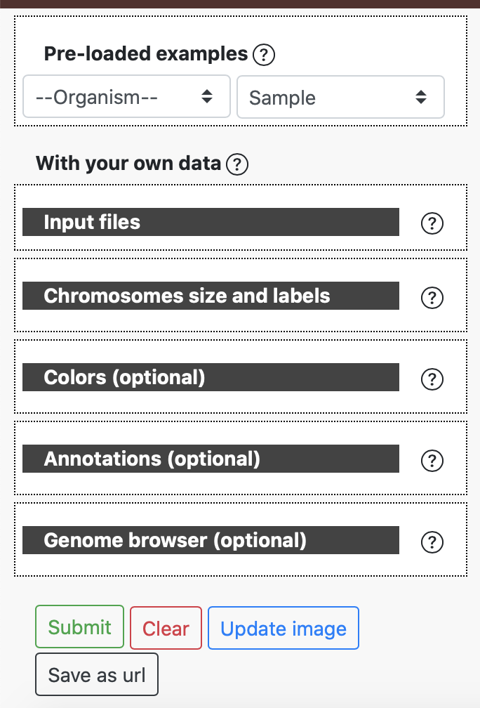
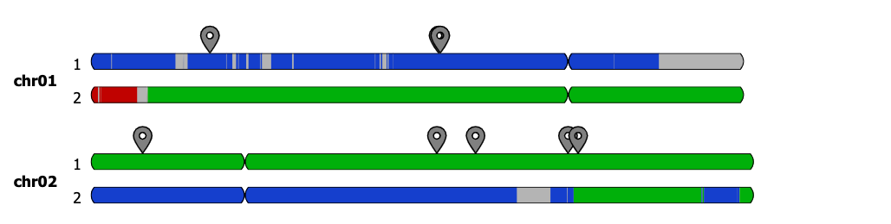
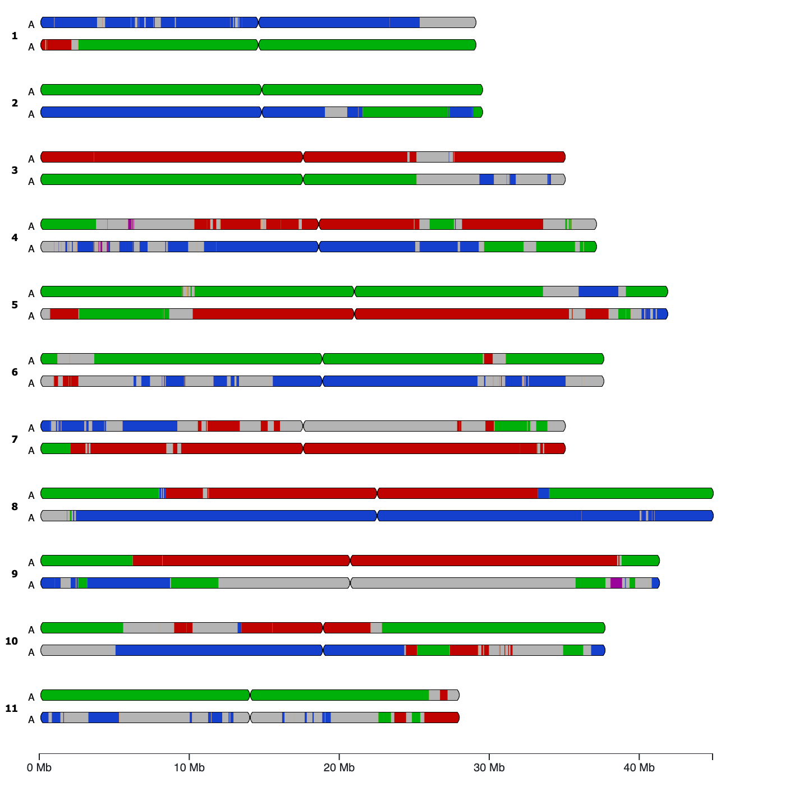
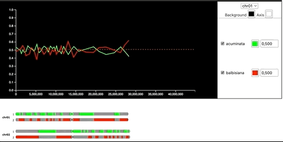

Introduction
============

GeMo is a WebApp to represent Genome Mosaics with current focus on plants. However, GeMo is developed in a generic way it can be also applied to other organisms.

Main features
~~~~~~~~~~~~~

-  Dynamic chromosome painting visualisation

-  Online Data curation of mosaic prediction

-  Markers or Genes Plots on mosaic karyotypes

-  Data and high quality image export

Input formats
~~~~~~~~~~~~~

GeMo requires two types of datasets to generate the ideogram visualization

The position of the mosaic blocks along the chromosomes. It accepts two types of files:

-  **Genomic blocks**

.. list-table::
   :header-rows: 1

   * - chr
     - haplotype
     - start
     - end
     - ancestral_group
   * - chr01
     - 0
     - 1
     - 29070452
     - g4
   * - chr01
     - 1
     - 1
     - 29070452
     - g4
   * - chr02
     - 0
     - 1
     - 29511734
     - g4
   * - chr02
     - 1
     - 1
     - 29511734
     - g4

-  **Normalized curves**

.. list-table::
   :header-rows: 1

   * - chr
     - start
     - end
     - V
     - T
     - S
   * - chr01
     - 1145
     - 189582
     - 0.001671988
     - 0.014082301
     - 0.001638686
   * - chr01
     - 189593
     - 356965
     - 0.001244196
     - 0.012867256
     - 0.001810139
   * - chr01
     - 356968
     - 488069
     - 0.001117959
     - 0.010035172
     - 0.000759437
   * - chr01
     - 488097
     - 633373
     - 0.002678213
     - 0.010470727
     - 0.003896031

-  **Chromosomes sizes and labels**

Chromosome data format, each column tab separated
chr, len, centromereInf (optional), centromereSup (optional), label (optional)

.. list-table::
   :widths: 25 25 25
   :header-rows: 1

   * - chr
     - len
     - label
   * - chr01
     - 37945898
     - AB
   * - chr02
     - 34728925
     - AB
   * - chr03
     - 40528553
     - AB
   * - chr04
     - 34728925
     - AB
   * - chr05
     - 44598304
     - AB
   * - chr06
     - 46248384
     - AB
   * - chr07
     - 42818424
     - AB
   * - chr08
     - 38870123
     - AB

-  **Optional files**

Users can provide their own color codes or use the online features (custom or color blind friendly palettes) 

**Color**

.. list-table::
   :header-rows: 1

   * - group
     - name
     - hex
   * - g1
     - group1
     - #000000
   * - g2
     - group2
     - #ffc000
   * - g3
     - group3
     - #1440cd
   * - g4
     - group4
     - #00b009

**Annotations**

A list of genomic coordinates (e.g. genes of interest, QTLs) can be provided in a BED-like to visually spot the corresponding regions on the chromosomes. This can be particularly useful to check correlations between parental/ancestral blocks and genes/regions of interest.
 
.. list-table::

   * - chr01
     - 5287838
     - 5289224
     - gene
     - 0
     - \-
   * - chr01
     - 15485703
     - 15486813
     - gene
     - 0
     - \+
   * - chr02
     - 2276353
     - 2277821
     - gene
     - 0
     - \+

     
Data outputs
~~~~~~~~~~~~

Once data is provided the chromosome diagram is generated on the fly. Chromosomes display colored blocks usually corresponding to their ancestral/parental origin. An interactive legend is present to label each group with a corresponding color. The user can modify the color of a group directly in the legend.

-  **Blocks**

In the example below, the 11 chromosomes of an doploid organism is visualized. Three main colors (green, blue and red) are visible and corresponds to 3 distinct genepools that contributed to the genetic make up of this genotype. The segements in grey corresponds to unknown.

   
-  **Curves**

In this mode, the graph represents the proportion of haplotypes of each ancestral origin along chromosomes. They are the results of a normalisation of the number of reads supporting each origin on a given window.

.. image:: _images/curve.png
   :target: _images/curve.png
   :width: 700
   :alt: curves

In this example, allelic ratio for a range of founding genepools are respresented by different colors for chromosome 1. Two genepools in green is the main contributor with smaller contribtuons from the blue and red gene pools.

Data curation and export
~~~~~~~~~~~~~~~~~~~~~~~~

Uploaded datasets are automatically loaded in the text box of the GeMo menu, allowing users to update the content and reflect it on the image by clicking on the "update image" button.

In curve mode,  users can visually set the threshold on the graph to recalculate the origin and size of clored block forming the mosacis. This can be particularly useful when multiple putative parental gene pools with unclear signals can create noisy mosaics or to switch segments from one haplotype to another for better consistency. Once a threshold is changed, the karyotype diagram is automatically updated.

For pre-loaded data, the curve mode can be activated only when the normalized curves dataset exists. In this case, a toggle button labeled "Curve based mode" is present at the top of the user input form.

GeMo offers the possibility to download the latest version of the data sets and export the output graphics as SVG for publication purposes. In addition, data can be also stored temporarily online with a unique URL allowing to share it with multiple users.

Live demo
~~~~~~~~~

GeMo is available for free to use at `<https://gemo.southgreen.fr/>`__ where
anyone can upload its own data or test with pre-loaded mosaics/datasets.

Citation
~~~~~~~~

Summo M, Comte A, Martin G, Weitz E, Perelle P, Droc G and Rouard M. GeMo: A mosaic genome painting tool for plant genomes. (in prep)

Acknowledgements
~~~~~~~~~~~~~~~~

GeMo has been developed in the framework of the `Genome Harvest project <https://www.genomeharvest.fr>`__ supported by the Agropolis
fondation.

Troubleshootings and web browser compatibility
~~~~~~~~~~~~~~~~~~~~~~~~~~~~~~~~~~~~~~~~~~~~~~

-  Some issues were reported for color management when using the exported SVG with Inkscape.

-  It is optimized for Chrome and works in Firefox and Edge but some design issues may occur with Safari.

The web interfaces were tested with the following platforms and web browsers:

.. list-table::
   :header-rows: 1

   * - OS
     - Version
     - Chrome
     - Firefox
     - Edge
     - Safari
   * - Windows 10
     - 10
     - 88.0.4324.150
     - 94.0.1
     - 96.0.1054.29
     - n/a
   * - Mac OS
     - 11.2
     - 97.0.4692.36
     - 94.0.2
     - n/a
     - 14.0.3

