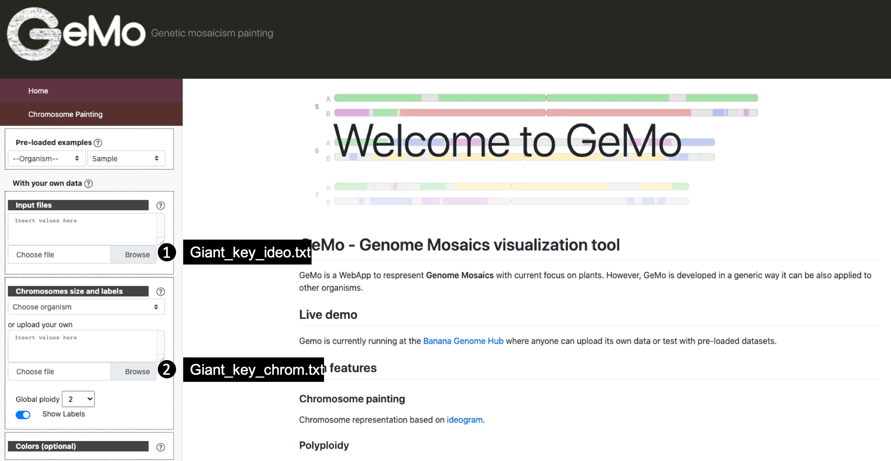

Chromosome painting using TraceAncestor
=======================================

TraceAncestor is a suite of script that allows to estimate the allelic dosage
of ancestral alleles in hybrid individuals and then to perform
chromosome painting.

Installation
~~~~~~~~~~~~

::

   git clone https://github.com/gdroc/GeMo_tutorials.git
   cd GeMo_tutorials
   
Download dataset, you only need to launch the script download_dataset.pl without any parameter

::

   perl download_dataset.pl

This script create a new directory data

::

   data/
   ├── Ahmed_et_al_2019_color.txt
   ├── Ahmed_et_al_2019_individuals.txt
   ├── Ahmed_et_al_2019_origin.txt
   ├── Ahmed_et_al_2019.vcf

Workflow
~~~~~~~~

vcf2gst.pl
^^^^^^^^^^

**Usage**

This script is used to define GST values from individuals that are
identified as pure breed for an ancestor.

Must be used on pure breed. If there is introgressed part on the genome
of the individual, the part must be removed before analysis.

.. code-block:: bash

   bin/vcf2gst.pl --help

   Parameters :
      --vcf       vcf containing the ancestors and other individuals to scan [Required]
      --ancestor  A two column file with individuals in the first column and group tag (i.e. origin) in the second column [Required]
      --depth     minimal depth for a snp to be used in the analysis (Default 5)
      --output    output file name (Default GSTmatrix.txt) 
      --help

**Input**

 --ancestor Ancestor file (Required)

A two column file with individuals in the first column and group tag (i.e. origin) in the second column

=========== ======
individuals origin
=========== ======
De_Chios    Mandarin
Shekwasha   Mandarin
Sunki       Mandarin
Cleopatra   Mandarin
Pink        Pummello
Timor       Pummello
Tahitian    Pummello
Deep_red    Pummello
Corsican    Citron
Buddha_Hand Citron
=========== ======

 --vcf VCF file (Required)

Now, you can run the following command

.. code-block:: bash

   perl bin/vcf2gst.pl --ancestor data/Ahmed_et_al_2019_origin.txt --vcf data/Ahmed_et_al_2019.vcf --output GSTMatrix.txt

**Output**

*The output is a CSV file containing GST (inter-population
differentiation parameter) information:*

*with :*

-  #CHROM = chromosome name
-  POS = position of DSNP
-  REF = Base of the reference allele of this DSNP
-  ALT = Base of the alternative allele of this DSNP
-  %Nref = Percentage of maximal missing data for this DSNP
-  GST = value of GST (inter-population differentiation parameter) (With
   1,2,3 the ancestors names)
-  F = Alternative allele frequency for each ancestor (With 1,2,3 the
   ancestors names)

prefilter.pl
^^^^^^^^^^^^

.. _usage-prefilter:

**Usage**

This script is used to define a matrix of ancestry informative markers
from the matrix gotten at the step 1.

.. code-block:: bash

   bin/prefilter.pl --help
   Parameters :
       --matrix    GST matrix [Required]
       --gst       threshold for gst (Default : 0.9)
       --missing   threshold for missing data (Default 0.3)
       --output    output file name (Default Diagnosis_matrix) 
       --help      display this help

Now, you can run the following command

.. code-block:: bash

   perl bin/prefilter.pl --matrix GSTMatrix.txt --output Diagnosis_matrix.txt

.. _output-prefilter:

**Output**

A matrix containing all the ancestry informative markers for every
ancestors.

*with:*

-  ancestor = Ancestor names
-  chromosome = Chromosome numbers
-  position = Position of the SNP marker
-  allele = Base of the ancestral allele

TraceAncestor.pl
^^^^^^^^^^^^^^^^

.. _usage-traceancestor:

**Usage**

.. code-block:: bash

   bin/TraceAncestor.pl --help

   Parameters :
       --matrix     Diagnosis matrix [Required]
       --vcf       vcf of the hybrid population 
       --individuals    A two column file with individuals to scan for origin (same as defined in the VCF headerline) in the first column and the ploidy in the second column [Required]
       --window    number of markers by window (Default 10)
       --lod       LOD value to conclude for one hypothesis (Default 3)
       --freq      theoretical frequency used to calcul the LOD (Default 0.99)
       --cut       number of K bases in one window (Default 100) 
       --dirout    Directory output (Default result)
       --help      display this help

**Input**

--individuals A two column file with individuals to scan for origin (same as defined in the VCF headerline) in the first column and the ploidy in the second column. 

Now, you can run the following command

.. code-block:: bash

   perl bin/TraceAncestor.pl --matrix Diagnosis_matrix.txt --vcf data/Ahmed_et_al_2019.vcf --individuals data/Ahmed_et_al_2019_individuals.txt

.. _ouputs-traceancestor:

**Output**

For each individual present in the file data/Ahmed_et_al_2019_individuals.txt, 4 4 outputs are produced,  prefixed with the name of indivual :

-  Bergamot_ideo.txt : the painting data. An Ideogram output compatible with GeMo
-  Bergamot_chrom.txt : the chromosomes data.
-  Bergamot_ancestor.txt : frequency of ancestors alleles along chromosome for the particular hybrid focused.
-  Bergamot_curve.txt : frequency of ancestors alleles along chromosome for the GeMo visualization tool.

Visualization and block refinement with GeMo
~~~~~~~~~~~~~~~~~~~~~~~~~~~~~~~~~~~~~~~~~~~~

Go to `GeMo <https://gemo.southgreen.fr/>`__ WebApp

-  Load data has follow

References
~~~~~~~~~~

-  `Ahmed,D. et al. (2019) Genotyping by sequencing can reveal the
   complex mosaic genomes in gene pools resulting from reticulate
   evolution: a case study in diploid and polyploid citrus. Annals of
   Botany, 123, 1231–1251. <https://doi.org/10.1093/aob/mcz029>`__
