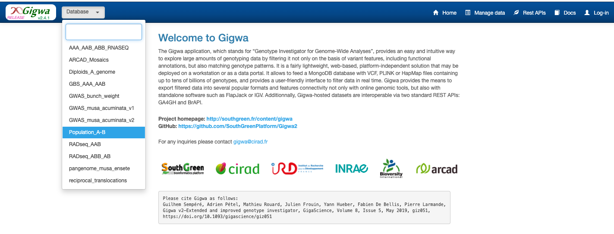
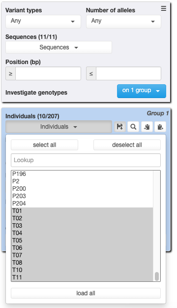

**This tutorial point to tools that are not yet available but that will
come soon**

This tutorial aimed at showing how data should be processed to be then
visualized with the GeMo

Installation
============

Install `VCFHunter <https://github.com/SouthGreenPlatform/VcfHunter>`__
following the documentation

Download datasets
=================

First, for this tutorial, you can use
`Gigwa <https://www.crop-diversity.org/gigwa/>`__, a web application for
managing and exploring high-density genotyping data, to download a VCF

-  Select the database Populations_A_B

-  Select the accessions P2 and T01 to T11 on the Indivuals drop down
   menu, and click on Search button

-  Download result (check radio “Export Metadata” and “Keep file on
   servers”)

.. image:: _images/export_gigwa.png
   :target: _images/export_gigwa.png
   :align: center
   :alt: Export Gigwa

Copy the link, and create a repository on your terminal

::

   mkdir VCFHunter
   cd VCF
   wget --no-check-certificate https://www.crop-diversity.org/gigwa/genofilt/tmpOutput/anonymousUser/b429763f507dc1bb2b169d7da5cf1804/Population_A-B__project1__2021-10-12__148329variants__VCF.zip
   unzip Population_A-B__project1__2021-10-12__148329variants__VCF.zip
   cut -f 1,6 Population_A-B__21individuals_metadata.tsv > Origin.tab
   sed -i 's:balbisiana:BB:' Origin.tab
   sed -i 's:acuminata:AA:' Origin.tab
   ls Population_A-B__148329variants__10individuals.vcf > Vcf.conf

VCF content

.. code-block:: bash

   grep "^#CHROM" Population_A-B__148329variants__21individuals.vcf
   #CHROM  POS ID  REF ALT QUAL    FILTER  INFO    FORMAT  ACC48-FPG   ACC48-FPN   ACC48-P_Ceylan  ACC48-Red_Yade  DYN163-Kunnan   DYN275-Pelipita DYN359-Safet_Velchi GP1 GP2 P1  P2  T01 T02 T03 T04 T05 T06 T07 T08 T10 T11

Principle
=========

The principle of this analysis is to :

1. Identify specific allele of distinct genetic pools,
2. Calculate the expected allelic ratio of these alleles in these
   genetic pools,
3. Calculate the observed allelic ratio a/several given accessions
4. Normalize these observed ratios using expected ratio to infer the
   number of haplotypes of each genetic pools that are present on a
   given windows of the studied accession.

Files obtained at the end of the process can be given to GeMo tools to
visualize data and optimize parameters.

Input
=====

-  Origin.tab
-  Vcf.conf is a file which contained path to vcf files which will be
   used for e-chromosome painting.
-  chromosome.tab (tabulated file with the chromosome name and lenght)
-  color.conf

===== ========== === === =
group name       r   g   b
===== ========== === === =
AA    acuminata  0   255 0
BB    balbisiana 255 0   0
===== ========== === === =

------------------------------------------------------------------------

Chromosome painting using non admixed ancestral accessions
==========================================================

1 - Identification of private alleles and formating output for more analysis
----------------------------------------------------------------------------

::

   <path_vcfhunter>/IdentPrivateAllele.py -c Vcf.conf -g Origin.tab -o step1 -a y  -m y  

In this first step, the program use genotyping information provided in
vcf files passed in *Vcf.conf* file and the file *Origin.tab* containing
the corresponding genetic pools of some accessions of the vcf to
identify alleles specific of each pools.

Outputs can be found in directory passed in *-o* option. For each
accessions identified as belonging to a genetic pool a directory is
created.

.. code-block:: bash

   tree step1
   step1
   ├── P2
   │   ├── P2_ratio.tab.gz
   │   └── tmp_1_P2_stats.tab
   ├── T01
   │   ├── T01_ratio.tab.gz
   │   └── tmp_1_T01_stats.tab
   ├── T02
   │   ├── T02_ratio.tab.gz
   │   └── tmp_1_T02_stats.tab
   ├── T03
   │   ├── T03_ratio.tab.gz
   │   └── tmp_1_T03_stats.tab
   ├── T04
   │   ├── T04_ratio.tab.gz
   │   └── tmp_1_T04_stats.tab
   ├── T05
   │   ├── T05_ratio.tab.gz
   │   └── tmp_1_T05_stats.tab
   ├── T06
   │   ├── T06_ratio.tab.gz
   │   └── tmp_1_T06_stats.tab
   ├── T07
   │   ├── T07_ratio.tab.gz
   │   └── tmp_1_T07_stats.tab
   ├── T08
   │   ├── T08_ratio.tab.gz
   │   └── tmp_1_T08_stats.tab
   ├── T10
   │   ├── T10_ratio.tab.gz
   │   └── tmp_1_T10_stats.tab
   └── T11
       ├── T11_ratio.tab.gz
       └── tmp_1_T11_stats.tab

2 - Determination of expected read ratio for each ancestral position based on ancestral accessions merged together
------------------------------------------------------------------------------------------------------------------
::

   <path_vcfhunter>/allele_ratio_group.py -g Origin.tab -p _ratio.tab.gz -o step2 -i step1

In this second step the program take the input of specific allele
identified in each accessions used to define genetic pools (ratio.tab.gz
files of *step1* folder) and calculate an average expected allele ratio
(globally a proxy of the fixation level of the allele) in the genetic
pool the allele belongs.

A tabulated file is generated per genetic pool with the following
format:

+-----------+-----------+-----------+-----------+-----------+-----------+
| c         | position  | allele    | genetic   | average   | number of |
| hromosome |           |           | pool      | allelic   | ancestral |
|           |           |           |           | ratio     | a         |
|           |           |           |           | observed  | ccessions |
+===========+===========+===========+===========+===========+===========+
| chr02     | 15033812  | A         | AA        | 0.9959677 | 8         |
|           |           |           |           | 419354839 |           |
+-----------+-----------+-----------+-----------+-----------+-----------+
| chr02     | 17722345  | G         | AA        | 1.0       | 8         |
+-----------+-----------+-----------+-----------+-----------+-----------+
| chr09     | 39501254  | T         | AA        | 1.0       | 8         |
+-----------+-----------+-----------+-----------+-----------+-----------+
| chr05     | 17536961  | T         | AA        | 1.0       | 8         |
+-----------+-----------+-----------+-----------+-----------+-----------+
| chr06     | 10144735  | A         | AA        | 0.9931737 | 8         |
|           |           |           |           | 588652483 |           |
+-----------+-----------+-----------+-----------+-----------+-----------+
| chr08     | 4718673   | T         | AA        | 0.9932432 | 8         |
|           |           |           |           | 432432432 |           |
+-----------+-----------+-----------+-----------+-----------+-----------+
| chr10     | 37498708  | T         | AA        | 0.9239074 | 8         |
|           |           |           |           | 518611573 |           |
+-----------+-----------+-----------+-----------+-----------+-----------+

3 - Calculation of observed ratio in other accessions
-----------------------------------------------------

The third step is to calculate, for each position in which an allele
specific of a genetic pool was identified, the observed allelic ratio in
a studied accession. In this example we calculate this ratio on the
Kunnan accession.

::

   <path_vcfhunter>/allele_ratio_per_acc.py -c Vcf.conf -g Origin.tab -i step2 -o step3 -a Kunnan

The output can be found in the *step3* folder passed in *-o* option.
This tabulated file contained 6 columns: column 1 corresponded to the
chromosome, column 2 is the position of the allele, column 3 is the
allele, column 4 corresponded to the observed allele frequency in the
accession, column 5 is the expected allele frequency calculated at step
2 and column 6 is the genetic group to which the allele has been
attributed.

For example : zmore step3/Kunnan_ratio.tab.gz

===== ===== ====== =================== =================== ===
chr   pos   allele obs_ratio           exp_ratio           grp
===== ===== ====== =================== =================== ===
chr01 20888 A      0.0                 0.23513227513227516 BB
chr01 20916 C      0.14754098360655737 0.28604868303910713 BB
chr01 21019 G      0.21875             0.3700537473602161  BB
chr01 67413 T      0.5818181818181818  1.0                 AA
chr01 67413 A      0.41818181818181815 1.0                 BB
chr01 67461 G      0.0                 0.975               AA
chr01 89923 G      0.6842105263157895  1.0                 AA
chr01 89923 T      0.3157894736842105  1.0                 BB
chr01 89958 T      0.6842105263157895  1.0                 AA
===== ===== ====== =================== =================== ===

4 - Calculation on sliding of the normalized observed ratio and ancestral blocs
-------------------------------------------------------------------------------

In this step, in a given sliding windows, the observed average allelic
ratio is calculated for each genetic pool and normalized by the expected
allelic ratio. The resulting value is used to infer the number of
haplotypes from the studied genetic pool present in the studied
accession.

Outpout are of two types: - *tab.gz* file containing normalized values
for each genetic pools in the given windows. This file contained 4 + X
columns, X being the number of genetic pools tested. The column 1
contained the chromosome name, column 2 contained the position of the
central allele in the windows, column 3 contained the start position of
the windows and column 4 contained the end position of the windows.
Columns 5 to end contained the normalized ratio calculated for the
accessions. A columns per genetic pool.

The second type of files generated are named
**Accession_chromosome_haplotype.tab** and contained the hypothesized
haplotypes from this accession given results from *tab.gz* file.
Haplotype are hypothetic ones that tries to minimize recombinations
events between distinct genetic pools. These files are formatted as
follows: column 1 contained accession name, column 2 contained
chromosome ID, column 3, 4 and 5 contained start, end, and origin of a
region.

.. code-block:: bash

   mkdir step4
   <path_vcfhunter>/PaintArp.py -a Kunnan -r step3/Kunnan_ratio.tab.gz -c color.conf -o step4/Kunnan -w 12 -O 0 -s chromosome.tab

5 - File formating for GeMo visualization
-----------------------------------------

This steps aims at reformatting the files so that they are compatible
with GeMo tool. GeMo tool performs two tasks, the first one consists in
drawing ancestral block identified at step 4. The second one also draw
these blocks but allowed refinement of these block using custom and
adjustable parameters. For block drawing of step 4 we will reformat
block files so that they match expectation with GeMo. For this run the
following command line:

.. code-block:: bash

   mkdir step5
   <path_vcfhunter>/convertForIdeo.py --name Kunnan --dir step4 --col color.conf --size chromosome.tab --prefix step5/Kunnan

This command generate several files. A file named

-  **Kunnan_ideo.tab** that contained block that could be drawn with
   GEMO (data section), a file named
-  **Kunnan_chrom.tab** that contained information required to draw
   chromosomes.
-  **Kunnan_color.tab** contained color information that could be used
   to draw blocks with custom color.
-  **Kunnan_win_ratio.tab**

For blocks refinement using custom and adjustable parameters. The file
of normalized ratio should be reformatted with this simple command line
to obtain a file named **Kunnan_win_ratio.tab**:

.. code-block:: bash

   zcat step4/Kunnan_win_ratio.tab.gz | awk '{$2=""; print $0}' | sed 's/CHR/chr/' | sed 's/Start/start/' | sed 's/End/end/' | sed 's/  / /g' | sed 's/ /\t/g' | sort -k1,1 -k2n,2  > step5/Kunnan_win_ratio.tab

Visualization and block refinement with GeMo
============================================

References
==========

-  `Baurens,F.-C. et al.(2019) Recombination and Large Structural
   Variations Shape Interspecific Edible Bananas Genomes. Mol Biol Evol,
   36, 97–111. <https://doi.org/10.1093/molbev/msy199>`__
-  `Martin et al., 2020a. Martin G, Cardi C, Sarah G, Ricci S, Jenny C,
   Fondi E, Perrier X, Glaszmann J-C, D’Hont A, Yahiaoui N. 2020. Genome
   ancestry mosaics reveal multiple and cryptic contributors to
   cultivated banana. Plant J.
   102:1008–1025. <https://doi.org/10.1111/tpj.14683>`__